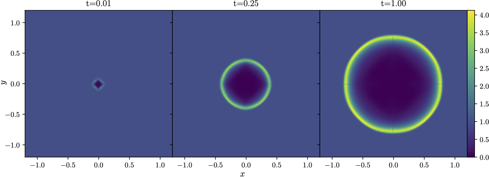

# HydroFV

Finite volume hydrodynamics solver for the compressible Euler's equation.

## Features
- Coordinate systems:
    * Cartesian 1D, 2D
    * Cylindrical 1D
    * Spherical 1D

- Riemann solvers:
    * Exact
    * HLLC

- Integrators:
    * Random choice 1D
    * Godunov first order upwind scheme
    * MUSCL-Hancock scheme
        - With Minmod, Van Leer and Monotonized Central (MC) slope limiters

## Requirements
Required:
- C compiler with C99 support
- HDF5 library for output

Optional:
- CMake
- OpenMP

## Compilation
### Using CMake
Take `examples/sod_shock_1d` as an example:
```
mkdir build
cd build
cmake [-DUSE_OPENMP=ON] ..
cmake --build . 
./sod_shock_1d
```
where `USE_OPENMP` is an optional flag to enable OpenMP parallelization.

## Sample usage and templates
Check the `examples` directory for sample usage and templates for 1D and 2D.



